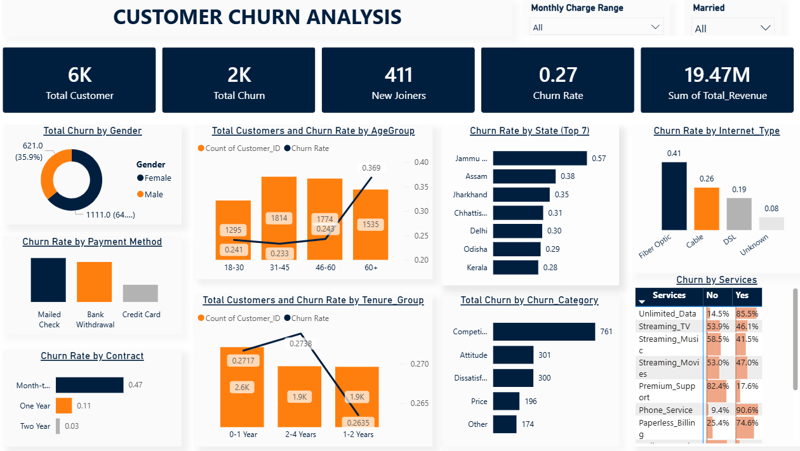
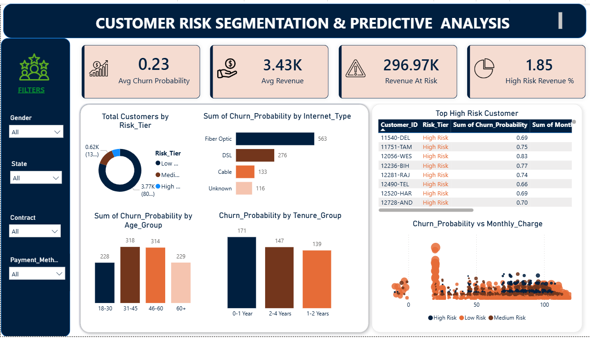

# 📉 Customer Churn Analysis – Telecom Customer Retention

_Predicting customer churn and segmenting at-risk customers to support retention strategy using SQL, Python, and Power BI._

---

## 📌 Table of Contents
- <a href="#overview">Overview</a>
- <a href="#business-problem">Business Problem</a>
- <a href="#dataset">Dataset</a>
- <a href="#tools--technologies">Tools & Technologies</a>
- <a href="#project-structure">Project Structure</a>
- <a href="#data-cleaning--preparation">Data Cleaning & Preparation</a>
- <a href="#exploratory-data-analysis-eda">Exploratory Data Analysis (EDA)</a>
- <a href="#churn-prediction-model">Churn Prediction Model</a>
- <a href="#customer-risk-segmentation">Customer Risk Segmentation</a>
- <a href="#research-questions--key-findings">Research Questions & Key Findings</a>
- <a href="#dashboard">Dashboard</a>
- <a href="#how-to-run-this-project">How to Run This Project</a>
- <a href="#final-recommendations">Final Recommendations</a>
- <a href="#author--contact">Author & Contact</a>

---
<h2><a class="anchor" id="overview"></a>Overview</h2>

This project analyzes telecom customer data to understand why customers churn, predict churn risk using machine learning, and segment retained customers into risk tiers for targeted retention action. A complete data pipeline was built using SQL (PostgreSQL) for data storage and querying, Python for cleaning, EDA, and predictive modeling, and Power BI for interactive dashboarding.

---
<h2><a class="anchor" id="business-problem"></a>Business Problem</h2>

Customer churn directly impacts recurring revenue in subscription-based businesses. This project aims to:
- Quantify overall churn rate and its revenue impact
- Identify which contract types, demographics, and services are associated with higher churn
- Build a predictive model to flag customers likely to churn before they leave
- Segment currently retained customers into risk tiers (High / Medium / Low) so the business can prioritize retention efforts
- Estimate revenue "at risk" within each segment

---
<h2><a class="anchor" id="dataset"></a>Dataset</h2>

- `Customer_Data.csv` — raw telecom customer dataset (6,418 customers, 32 columns), loaded into a PostgreSQL table `customer_data`
- Fields include Customer ID, Gender, Age, State, Tenure, Contract Type, Internet Type, Monthly Charge, Total Revenue, Customer Status (Stayed / Churned / Joined), Churn Category, Churn Reason, and service add-ons (Online Security, Premium Support, Device Protection Plan)
- `customer_risk_segments.csv` — model output: 4,686 retained customers scored with churn probability and assigned a risk tier, used to power the Power BI dashboard

---
<h2><a class="anchor" id="tools--technologies"></a>Tools & Technologies</h2>

- **SQL (PostgreSQL)** — data storage, aggregation queries (CTEs, GROUP BY, window-style percentage calculations)
- **Python** — Pandas, NumPy, Matplotlib, Seaborn, SQLAlchemy, Scikit-learn (RandomForestClassifier, LabelEncoder, train/test split, cross-validation, ROC-AUC)
- **Power BI** — interactive dashboard for churn KPIs and risk segmentation
- **GitHub** — version control and project documentation

---
<h2><a class="anchor" id="project-structure"></a>Project Structure</h2>

```
customer-churn-analysis/
│
├── README.md
├── customer_churn_analysis.sql          # SQL queries for KPIs and segment analysis
├── Customer_churn_analysis.ipynb        # Full Python pipeline: cleaning, EDA, ML model, segmentation
├── customer_risk_segments.csv           # Model output used in Power BI
└── Customer_Churn_analysis.pbix         # Power BI dashboard
```

---
<h2><a class="anchor" id="data-cleaning--preparation"></a>Data Cleaning & Preparation</h2>

- Removed duplicate customer records
- Converted `Monthly_Charge`, `Total_Charges`, and `Total_Revenue` to numeric, coercing invalid entries
- Filled missing numeric values (Monthly Charge, Total Charges, Total Revenue, Age, Tenure) with the column median
- Filled missing categorical values with `"Unknown"`
- Stripped extra whitespace from text columns and standardized `Customer_Status` values (Stayed / Churned / Joined)
- Engineered new features:
  - `Churn_Flag` — binary flag (1 = Churned, 0 = otherwise)
  - `Tenure_Group` — binned into 0-1 Year, 1-2 Years, 2-4 Years, 4-6 Years
  - `Age_Group` — binned into 18-30, 31-45, 46-60, 60+
- Loaded the cleaned dataset into PostgreSQL (`customer_data` table) via SQLAlchemy for SQL-based analysis

---
<h2><a class="anchor" id="exploratory-data-analysis-eda"></a>Exploratory Data Analysis (EDA)</h2>

Key visuals built in Python (Matplotlib/Seaborn):
- Overall churn distribution (donut chart)
- Churn rate by contract type
- Churn rate by age group
- Monthly charge distribution — retained vs. churned
- Churn rate by internet type
- Tenure vs. monthly charge scatter plot
- Revenue comparison — retained vs. churned customers
- Churn rate with vs. without service add-ons (Online Security, Premium Support, Device Protection)

**Headline numbers:**
- Total customers: **6,418**
- Total churned: **1,732**
- Overall churn rate: **26.99%**
- New joiners (tenure ≤ 3 months): **644**

---
<h2><a class="anchor" id="churn-prediction-model"></a>Churn Prediction Model</h2>

A **Random Forest Classifier** (300 trees, max depth 10, class-balanced) was trained to predict churn probability:

- Train/test split: 5,134 / 1,284 customers (80/20, stratified)
- **Test ROC-AUC: 0.858** | **5-fold CV ROC-AUC: 0.865**
- Classification report:

| Class | Precision | Recall | F1-score |
|---|---|---|---|
| Retained | 0.90 | 0.81 | 0.85 |
| Churned | 0.59 | 0.75 | 0.66 |

- Overall accuracy: **79%**
- Feature importance, ROC curve, and confusion matrix charts generated to explain model behavior

---
<h2><a class="anchor" id="customer-risk-segmentation"></a>Customer Risk Segmentation</h2>

The trained model was used to score all **retained** customers (4,686) with a churn probability, then bucket them into risk tiers:

| Risk Tier | Customers | Avg. Churn Probability | Avg. Monthly Charge | Total At-Risk Revenue |
|---|---|---|---|---|
| 🔴 High Risk (≥0.65) | 296 | 0.73 | $73.25 | $296,969.99 |
| 🟠 Medium Risk (0.40–0.65) | 624 | 0.52 | $66.94 | $1,260,777.81 |
| 🟢 Low Risk (<0.40) | 3,766 | 0.15 | $58.01 | $14,501,682.03 |

This segmentation was exported to `customer_risk_segments.csv` and feeds the Power BI dashboard for targeted retention campaigns.

---
<h2><a class="anchor" id="research-questions--key-findings"></a>Research Questions & Key Findings</h2>

1. **Contract type is the strongest churn driver**: Month-to-Month customers churn at **46.5%**, vs. **11.0%** for One Year and just **2.7%** for Two Year contracts.
2. **High-risk customers pay more**: The High Risk tier has the highest average monthly charge ($73.25) — pricing sensitivity may be a churn factor.
3. **Revenue is concentrated in low-risk customers**: Low Risk customers account for the vast majority of retained revenue (~$14.5M), meaning retention efforts should focus on converting Medium Risk customers before they slip further.
4. **Nearly 10% of tenure customers are new joiners** (tenure ≤ 3 months) — an important cohort for early-engagement retention programs.
5. **Model can reliably rank churn risk**: ROC-AUC of ~0.86 indicates the Random Forest model separates churners from non-churners well, especially useful for prioritizing the Medium Risk segment.

---
<h2><a class="anchor" id="dashboard"></a>Dashboard</h2>

A **2-page interactive Power BI dashboard** with slicers for Monthly Charge Range, Married, Gender, State, Contract, and Payment Method.

**Page 1 — Customer Churn Analysis**
- KPI cards: 6K Total Customers | 2K Total Churn | 411 New Joiners | 0.27 Churn Rate | 19.47M Sum of Total Revenue
- Total churn by gender
- Total customers & churn rate by age group and by tenure group
- Churn rate by state (top 7), payment method, contract, and internet type
- Churn by services matrix (Unlimited Data, Streaming TV/Music/Movies, Premium Support, Phone Service, Paperless Billing)



**Page 2 — Customer Risk Segmentation & Predictive Analysis**
- KPI cards: 0.23 Avg Churn Probability | 3.43K Avg Revenue | 296.97K Revenue At Risk | 1.85% High Risk Revenue %
- Total customers by Risk Tier (Low / Medium / High)
- Sum of churn probability by internet type, age group, and tenure group
- Top High Risk Customers table with churn probability and revenue
- Churn Probability vs. Monthly Charge scatter plot, colored by risk tier
- Filters for Gender, State, Contract, and Payment Method



<h2><a class="anchor" id="how-to-run-this-project"></a>How to Run This Project</h2>

1. Clone the repository:
```bash
git clone https://github.com/yourusername/customer-churn-analysis.git
```
2. Load `Customer_Data.csv` into PostgreSQL (update credentials in the notebook):
```bash
# Run the data-loading cell in Customer_churn_analysis.ipynb
# It uploads the cleaned dataframe into a `customer_data` table
```
3. Run the SQL analysis:
```bash
psql -d customer_churn_db -f customer_churn_analysis.sql
```
4. Open and run the notebook end-to-end:
   - `Customer_churn_analysis.ipynb` (cleaning → EDA → Random Forest model → risk segmentation → CSV export)
5. Open the Power BI dashboard:
   - `Customer_Churn_analysis.pbix` (refresh data source to point at `customer_risk_segments.csv`)

---
<h2><a class="anchor" id="final-recommendations"></a>Final Recommendations</h2>

- Prioritize retention outreach on the **Medium Risk** tier — largest at-risk revenue pool with room to move customers toward "Low Risk"
- Offer incentives to move Month-to-Month customers onto One Year or Two Year contracts
- Investigate pricing/value perception for high-monthly-charge customers, since they skew High Risk
- Strengthen onboarding for new joiners (tenure ≤ 3 months) to reduce early-tenure churn
- Promote service add-ons (Online Security, Premium Support, Device Protection) shown to correlate with lower churn

---
<h2><a class="anchor" id="author--contact"></a>Author & Contact</h2>

**Sumita Das**
Data Analyst (Fresher)
📍 Kolkata, India
📧 Email: dassumita647@gmail.com
🔗 [LinkedIn](https://www.linkedin.com/in/sumita-das-124742236/)

